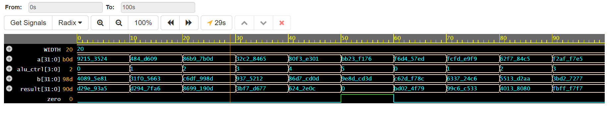

# Parametric 32-Bit RISC-V ALU

## 📌 Project Overview
This repository contains a high-performance, parametric 32-bit Arithmetic Logic Unit (ALU) design compliant with core RISC-V architectural requirements. The design is implemented in Verilog and verified using an automated, self-checking SystemVerilog testbench.

## ⚡ Technical Architecture
* **Design Approach:** Parametric hardware description allowing for configurable bit-widths (default: 32-bit).
* **Instruction Support:** ADD, SUB, AND, OR, XOR, and SLT (Set Less Than).
* **Verification Method:** Randomized stimulus generation and automated result checking to ensure functional coverage.

## 📊 Verification Results
The simulation waveforms demonstrate successful operation across the instruction set, with the zero-flag correctly asserting on null results.

## 🛠️ How to Replicate
1. Access the code on [EDA Playground](https://www.edaplayground.com/).
2. Load the `alu.v` design and `testbench.sv` files.
3. Select **Icarus Verilog 12.0** as the simulator.
4. Run the simulation to view waveforms in EPWave.
